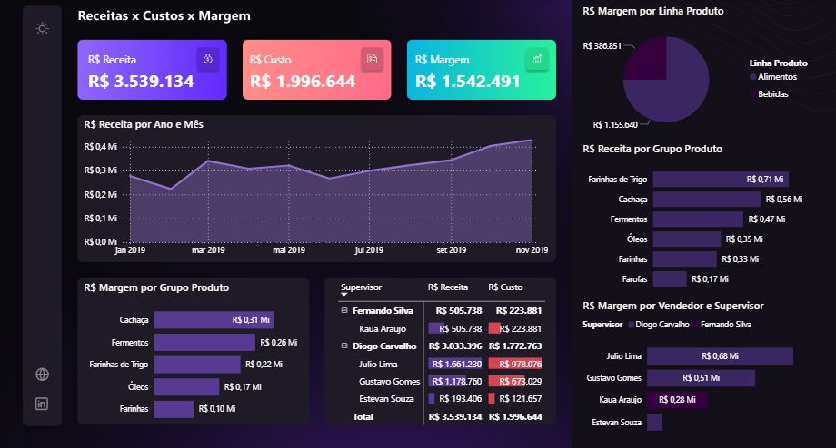

--

# *📊 Sobre o Projeto*

Este projeto consiste no desenvolvimento de um dashboard no Microsoft Power BI com o objetivo de analisar dados de vendas, custos e margem, permitindo identificar os produtos e categorias mais lucrativas.

*🗂️ Base de Dados*

Os dados foram extraídos de planilhas do Microsoft Excel, contendo informações sobre produtos e vendas.
📦 Tabela de Produtos
Contém os seguintes campos:
Código do Produto
Grupo do Produto
Linha do Produto
Fornecedor
Custo Unitário
🧾 Tabela de Vendas
Contém os seguintes campos:
Data da Venda
Nota Fiscal
Código do Produto
Código do Vendedor
Nome do Vendedor
Supervisor
Quantidade
Valor Unitário
Receita

*⚙️ Tratamento dos Dados*

Relacionamento entre as tabelas utilizando o Código do Produto
Organização dos dados para análise no Power BI
Padronização de campos e tipos de dados

*📐 Medidas Criadas*
Foram desenvolvidas medidas para análise de desempenho:
Receita Total
Custo Total
Margem
Margem = Receita - Custo

*📈 Análises Realizadas*
O dashboard permite:
Analisar receita ao longo do tempo
Comparar custos e lucros
Identificar produtos mais rentáveis
Avaliar desempenho por grupo de produto
Filtrar por vendedor e supervisor

*🧠 Principais Insights*
Produtos do grupo Cachaça apresentam maior margem
Categorias como Farinhas possuem menor rentabilidade
A análise temporal permite identificar variações nas vendas

*🎯 Objetivo do Projeto*
Transformar dados brutos em informações visuais e estratégicas para auxiliar na tomada de decisão.

Transformar dados brutos em informações visuais e estratégicas para auxiliar na tomada de decisão.
